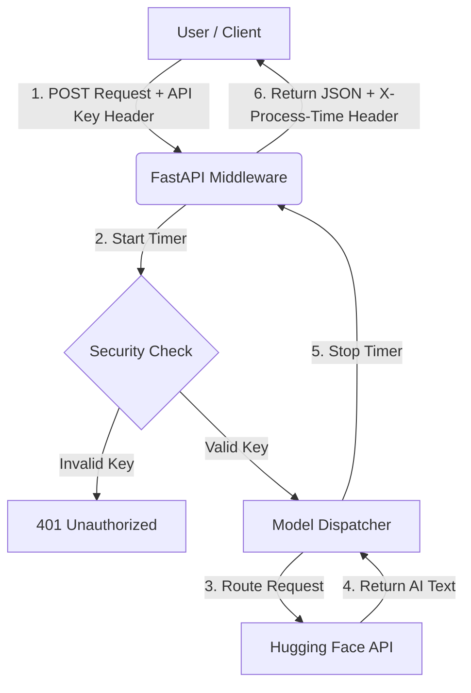

# FastAPI LLM Benchmark (Learning Project)

Welcome to the **FastAPI LLM Benchmark** project! If you are a beginner looking to understand how modern backend APIs communicate with AI models, you are in the right place. 

This project was built to solve a specific problem: **How do we measure the speed (latency) of different Large Language Models (LLMs) in real-time without needing expensive hardware?**

---

## 🎯 What Does This Project Do?

This is a lightweight microservice built with **FastAPI** (a modern, fast web framework for Python). It acts as a middleman between a user and state-of-the-art AI models. 

Instead of running heavy models on our own computer, we use the **Hugging Face Inference API**. This means all the heavy lifting is done remotely on Hugging Face's servers, and our application simply sends the prompt, waits for the response, and measures exactly how many milliseconds it took.

### Models We Are Testing:
1. **Llama 3 (8B Instruct)** - By Meta
2. **Qwen 2.5 (7B Instruct)** - By Alibaba Cloud
3. **Gemma 2 (9B Instruct)** - By Google

---

## 🧠 Why Was This Built? (The Evolution)

Initially, this project attempted to aggregate models using external routing services (like OpenRouter). However, a key lesson was learned: **external APIs can add unpredictable latency**. 

To get the most accurate speed tests and immediate access to new models the day they are released, the architecture was pivoted to integrate *directly* with Hugging Face's infrastructure. This provides a clean, robust, and zero-local-footprint solution.

---

## 🏗️ Architecture: How It Works

Here is a visual representation of how data flows through the application:



### Key Technical Concepts Used:
1. **Asynchronous Programming**: We use `async` and `await` so our server doesn't freeze while waiting for Hugging Face to reply. It can handle other requests in the meantime!
2. **Dependency Injection**: We secure our API by forcing requests to include a specific Header (`x-api-key`). FastAPI handles checking this automatically before our code even runs.
3. **Middleware**: We intercept every request as it comes in and as it leaves to log the exact processing time, adding it as an HTTP header (`X-Process-Time`).

---

## 🚀 How to Run It Yourself

### Step 1: Prerequisites
- Python 3.10 or higher.
- A free Hugging Face account and an Access Token ([Get it here](https://huggingface.co/settings/tokens)).

### Step 2: Installation
Clone the repository and install the required Python packages:
```bash
pip install -r requirements.txt
```

### Step 3: Environment Setup
Create a file named `.env` in the root folder. This file holds your secrets. **Never upload this file to GitHub!** (We use a `.gitignore` file to prevent this).

Add the following to your `.env` file:
```ini
# This is a custom password YOU create to protect your API. Make it 16+ chars.
API_KEY=MySuperSecretKey_2026_!

# This is the token you got from Hugging Face
HUGGINGFACE_TOKEN=hf_your_token_here
```

### Step 4: Start the Server
Run the application using Uvicorn (an ASGI web server):
```bash
uvicorn app.main:app --reload
```
*The `--reload` flag means the server will automatically restart if you change any code.*

Your API is now running locally at `http://127.0.0.1:8000`.

---

## 📊 Testing the Models (The Benchmark)

We wrote a custom Python script that talks to our own API to test all three models simultaneously.

Run the script in a new terminal window:
```bash
python compare.py
```
You will see a beautiful terminal table showing exactly which model is the fastest right now!

---

## 🧪 Automated Testing

Professional developers write tests to ensure their code works. We use `pytest`.

To run the tests:
```bash
pytest
```
Our tests do three things:
1. Ensure the API rejects unauthorized users.
2. Verify endpoints return the correct data formats.
3. **Mocking**: We "fake" the Hugging Face API during tests so we don't accidentally consume our usage limits while testing!
