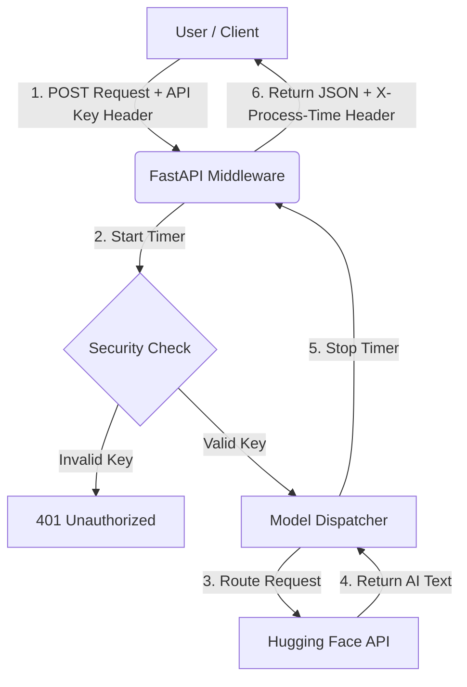

# FastAPI LLM Latency Benchmark


A high-performance, asynchronous microservice built to benchmark and route requests to various Large Language Models (LLMs) via the Hugging Face Serverless Inference API. This project demonstrates modern API development, dependency injection, secure authentication, and robust error handling.

---

## 🎯 What Does This Project Do?

This is a lightweight microservice built with **FastAPI** (a modern, fast web framework for Python). It acts as a middleman between a user and state-of-the-art AI models. 

Instead of running heavy models on our own computer, we use the **Hugging Face Inference API**. This means all the heavy lifting is done remotely on Hugging Face's servers, and our application simply sends the prompt, waits for the response, and measures exactly how many milliseconds it took.

### Models We Are Testing:
1. **Llama 3 (8B Instruct)** - By Meta
2. **Qwen 2.5 (7B Instruct)** - By Alibaba Cloud
3. **Gemma 2 (9B Instruct)** - By Google
4. **Mistral (7B Instruct)** - By Mistral AI

---

## 🧠 Architecture & Design Patterns

This application was engineered to minimize overhead and maximize throughput when interacting with external LLM providers.

- **Asynchronous I/O:** Utilizes `asyncio` and `httpx` to ensure the server remains non-blocking during remote LLM inference.
- **Dependency Injection:** Secures endpoints using FastAPI's `Security` dependencies for robust API Key validation.
- **Modular Handlers:** Employs a factory-style pattern where each LLM has a dedicated, isolated handler class, making the system highly extensible.
- **Middleware Timing:** Implements global HTTP middleware to accurately measure and inject `X-Process-Time` headers into every response.

---

## 🏗️ Architecture: How It Works

Here is a visual representation of how data flows through the application:


### Request Flow:
1. Client POSTs to `/generate` with `x-api-key`.
2. **Middleware** starts the latency timer.
3. **Security Dependency** validates the API key.
4. Payload is validated against **Pydantic Schemas**.
5. Request is routed to the specific LLM Handler (`LlamaHandler`, `MistralHandler`, etc.).
6. Asynchronous HTTP request is made to the Hugging Face Inference API.
7. **Middleware** stops the timer and attaches the latency header to the JSON response.

---

## 🚀 How to Run It Yourself

### Step 1: Prerequisites
- Python 3.10 or higher.
- A free Hugging Face account and an Access Token ([Get it here](https://huggingface.co/settings/tokens)).

### Step 2: Installation
Clone the repository and install the required Python packages:
```bash
pip install -r requirements.txt
```

### Step 3: Environment Setup
Create a file named `.env` in the root folder. This file holds your secrets. **Never upload this file to GitHub!** (We use a `.gitignore` file to prevent this).

Add the following to your `.env` file:
```ini
# This is a custom password YOU create to protect your API. Make it 16+ chars.
API_KEY=MySuperSecretKey_2026_!

# This is the token you got from Hugging Face
HUGGINGFACE_TOKEN=hf_your_token_here
```

### Step 4: Start the Server
Run the application using Uvicorn (an ASGI web server):
```bash
uvicorn app.main:app --reload
```
*The `--reload` flag means the server will automatically restart if you change any code.*

Your API is now running locally at `http://127.0.0.1:8000`.

---

## 📊 Testing the Models (The Benchmark)

We wrote a custom Python script that talks to our own API to test all three models simultaneously.

Run the script in a new terminal window:
```bash
python compare.py
```
This utility provides a formatted terminal summary, identifying current model latency leaders.

---

## 🧪 Automated Testing Suite

This project maintains high reliability through a comprehensive `pytest` suite.

To execute the test suite:
```bash
python -m pytest -v
```

**Testing Features:**
- **Endpoint Coverage:** Verifies all routes (`/`, `/health`, `/generate`).
- **Security Validation:** Ensures `401 Unauthorized` is returned for invalid or missing API keys.
- **Input Validation:** Verifies `422 Unprocessable Entity` for unsupported model requests.
- **API Mocking:** Utilizes `unittest.mock.AsyncMock` to simulate Hugging Face API responses, ensuring the test suite runs instantly without consuming network bandwidth or API rate limits.
