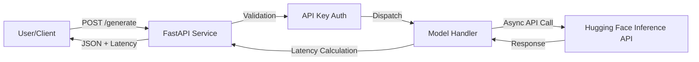

# LLM Latency Testbed

A specialized environment for testing and comparing the performance of Large Language Models via the **Hugging Face Inference API**.

## 🚀 Overview

This project serves as a clean testbed to measure the responsiveness (latency) of open-weight models. It is built as a lightweight FastAPI service, making it easy to integrate into larger AI pipelines.

### Supported Models
- **Llama 3 8B Instruct**
- **Qwen 2.5 7B Instruct**
- **Gemma 2 9B Instruct**

---

## 🛠️ Architecture



---

## ⚙️ Setup & Installation

### Prerequisites
- Python 3.10+
- A Hugging Face Access Token ([Get it here](https://huggingface.co/settings/tokens))

### Steps
1. **Clone the repository.**
2. **Install dependencies:**
   ```bash
   pip install -r requirements.txt
   ```
3. **Configure Environment:**
   Create a `.env` file with your credentials:
   ```ini
   API_KEY=your_secure_internal_key
   HUGGINGFACE_TOKEN=hf_your_token_here
   ```

---

## 🏃 Running the Application

### Start the Server
```bash
uvicorn app.main:app --reload
```
The API will be available at `http://127.0.0.1:8000`.

### Run Comparison Script
Compare the models in real-time:
```bash
python compare.py
```

---

## 🧪 Testing

The project includes automated tests using `pytest` to ensure reliability and security.

### Run all tests
```bash
pytest
```

### What is tested?
- **Endpoint Health**: Verifies `/` and `/health` are functional.
- **Authentication**: Confirms that invalid API keys are rejected.
- **Model Inference**: Mocks external API calls to verify model handlers process requests and responses correctly.

---

## 📄 License
MIT License
